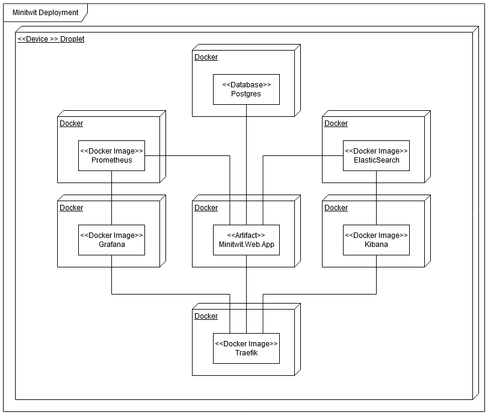

### Architecture 

 
*Figure 2: Deployment diagram of the MiniTwit system.*

The MiniTwit system is deployed on a Droplet, a server hosted by the cloud provider [DigitalOcean](https://www.digitalocean.com/). 
The different services are containerized with docker and orchestrated with docker-compose, which also handles startup order. In the current iteration of the system this is all done on a single server as can be seen in figure 2. Each component could be moved to separate servers without major problems, a process that was in progress on the branch [swarm](https://github.com/jlndk/devoops/tree/swarm) but ultimately was not finished in time. More on this in the Scaling section. 

#### Sub systems

[Traefik](https://containo.us/traefik/) is used as a reverse proxy and edge router. As shown in figure X (TODO: Update) Traefik interacts with the three public facing parts of the system, namely MiniTwit.Web.App, Kibana and Grafana. It provides both SSL certificates management and HTTPS, as well as load balancing when using Docker Swarm.

The main application, MiniTwit.Web.App, described in the previous section, interacts with the PostgreSQL database where all data is stored.

Monitoring can be seen on the left of figure 2 with Grafana and Prometheus. Here Prometheus interacts with the main application and pulls data which then can be displayed in Grafana.

Logging happens through ElasticSearch which has data pushed to it from the main application through the use of the C# library SeriLog. Kibana then pulls data from ElasticSearch to display to the user.
