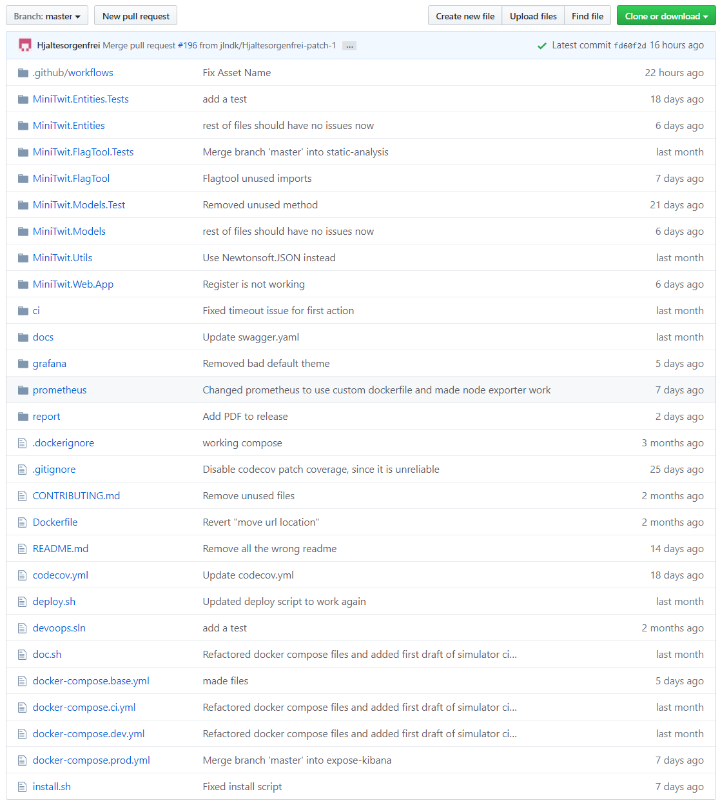

## Repository structure
The repository used for this project follows a mono-repository structure, with multiple projects inside it. The root level of the repository looks like this:

 
A single Visual Studio solution contains all the files of the project, organized into folders based on the different parts of the application. Some of these folders contain .NET projects, while others contain the configuration for the various DevOps-related services.

This repository structure has worked reasonably well. It is quick and easy to use, when you want to make changes to Grafana you go into the Grafana folder and so on. But this may be due to the somewhat limited scope of the application. As the repository has grown to include many different services, it has also become harder to get a quick overview of the contents, as the root level now have 28 files and folders. Going forward it may have be valuable to create a further distinction between the source code of the core application and the configuration files for the related services around the application. A poly-repo approach would likely be more trouble than it is worth for this exact application, but would be well suited if the project grew in scope and more services were added.
