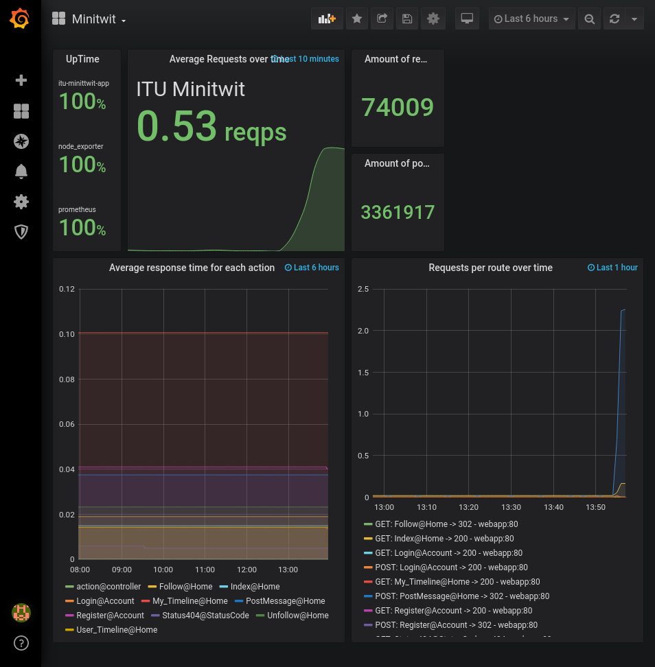

### Monitoring

It is important to have knowledge of quantities, frequencies, and speeds in a system, both to improve technical bottlenecks and to communicate important metrics to project stakeholders.  
Monitoring is the process of obtaining and saving this information, along with having easy access to the data, possibly through visualizations and dashboards.

The simplest monitoring of the application happens at [Digital Ocean](https://www.digitalocean.com/), the cloud provider for the system.
Built into their dashboards are graphs over system metrics, such as uptime, CPU, RAM and network usage.
The Digital Ocean dashboards are very basic, especially for uptime monitoring, but they are also incredibly simple to set up and use.
In the early stages of the project, this was all the monitoring the system had.

To monitor more closely what each process is doing, the project utilizes [Prometheus](https://prometheus.io/docs/introduction/overview/). Prometheus is a metrics scraber and time-series database, capable of gathering and storing information that changes over time. Very few metrics are available by default, such as uptime, but since Prometheus uses a generalized protocol build on top of HTTP, all kinds of metrics can be scraped and stored. However, since Prometheus only understands this protocol separate utilities must be used to translate preexisting information. One example of this is [node_exporter](https://github.com/prometheus/node_exporter),  that collects and exposes system-level metrics for Linux machines, such as CPU, memory, disk usage, and network traffic.
If an application does not expose Prometheus metrics by default, a custom exporter can relatively easily be built.
Many programming languages even have packages for simplifying this process even more.
In the project, we did exactly that, and used the NuGet package ([prometheus-net](https://www.nuget.org/packages/prometheus-net)) for the purpose.
It automatically exposes metrics related to ASP.NET, like HTTP request length, request frequency/volume for each controller method, response times, error rates, and more.

For visualizing the data, [Grafana](https://grafana.com/grafana/) is used.
Grafana is an analytics platform for easy visualization and alerts of monitored metrics, with built-in support for Prometheus.
It is easy and fast to set up dashboards, and Grafana is also very extensible.
One plugin the project utilizes is the PostgreSQL plugin, making it easy to visualize data from the database layer via SQL queries.

The things that the team chose to visualize are:

- Response times for different segments of the application (web-app, Node Exporter, Prometheus)
- Average response time per API action
- Request volume per API action
- Amount of registered users (via SQL query)
- Amount of posted twits (via SQL Query)

 
*Figure 6: Main Grafana dashboard.*

These business metrics are pretty basic and many more could be included. But there simply weren't the necessary time to implement more metrics in Grafana.
By using an open-source dashboard it was possible to utilize the metrics from node_exporter to get a lot of metrics without a lot of effort, which can be viewed [here https://grafana.minitwit.tk/d/rYdddlPWk/node-exporter-full?orgId=1](https://grafana.minitwit.tk/d/rYdddlPWk/node-exporter-full?orgId=1).

 
*Figure 7: Grafana node_exporter dashboard.*

One of the things that cannot be monitored reliably with these two solutions is whether the system is accessible through the internet.
For this, a service called [Oh Dear](https://ohdear.app) was used. This service attempts to visit the configured application from multiple places around the world every 2 minutes, and will send notifications through email and on discord if the site cannot be accessed. Furthermore, Oh Dear also keeps track of total downtime along with various other metrics, such as TLS certificate health and broken links.
This tool has been immensely useful for ensuring that the system was available at all times, as well as monitoring our SLA.
See appendix 1 for an attached uptime report.
