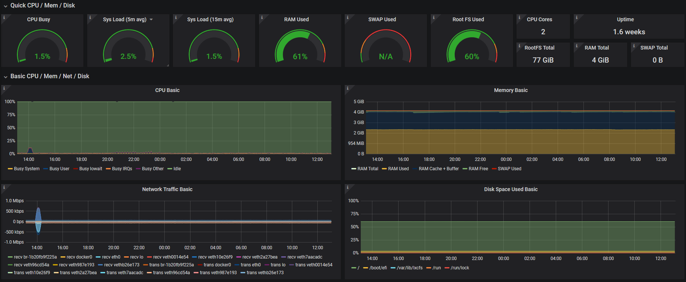

### Monitoring

It is important to have knowledge of quantities, frequencies, and speed in a system, both so it is possible to improve response times and the like, but also to tell the investors facts about the system a la amount of users, rate of adoption, etc.
Monitoring is the process of obtaining and saving this information, along with having easy access to the data, possibly through visualizations and dashboards.

The simplest monitoring in the application happens at [Digital Ocean](https://www.digitalocean.com/), the cloud provider for the system.
Built into their dashboards are graphs over uptime, CPU usage, and the like.
It is very basic for being uptime monitoring, but incredibly simple to initialize and use.
This was, in the early stages, all the monitoring the system had.

In order to monitor more closely what each process is doing, the project utilizes [Prometheus](https://prometheus.io/docs/introduction/overview/). Prometheus is a systems monitoring toolkit, capable of gathering and storing information about processes running as well as being extended to monitor even more specific things, based on what is running on the system. Standard metrics for monitoring include CPU usage, process memory/CPU/disk usage, the simple low-level information.

In the project, Prometheus has an extension to interface with the web app through a NuGet package ([prometheus-net](https://www.nuget.org/packages/prometheus-net)).
It makes Prometheus capable of logging information relating to ASP.NET, things like HTTP request length, request frequency/volume, error rates and the like.

For visualizing the data, [Grafana](https://grafana.com/grafana/) is used.
Grafana is an analytics platform for easy visualization and alerts in relation to monitored metrics, with built-in support for Prometheus.
It is easy and fast to set up dashboards, and Grafana is also very extensible.
One plugin the project utilizes is the PostgreSQL plugin, making it easy to visualize data from the database layer via SQL queries.

The things that the team chose to visualize are:

- Response times for different segments of the application (web-app, Node Exporter, Prometheus)
- Average response time per API action
- Request volume per API action
- Amount of registered users (via SQL query)
- Amount of posted twits (via SQL Query)

These business metrics are pretty basic and many more could be included. But there simply weren't the necessary time to implement more metrics in Grafana.
By using node_exporter and an open-source dashboard it was possible to get a lot of metrics without a lot of effort, they can be viewed [here https://grafana.minitwit.tk/d/rYdddlPWk/node-exporter-full?orgId=1](https://grafana.minitwit.tk/d/rYdddlPWk/node-exporter-full?orgId=1).

 
 One of the things that cannot be monitored reliably with these two solutions is if our system is actually accessible through the internet.
 For this, we use a service called [https://ohdear.app](OhDear). This service tries to visit our application from multiple places every 2 minutes, and will notify us, through email and on discord, if they can not access it. Furthermore, they also keep track of total downtime along with various other metrics, such as TLS certificate health and broken links.
 This tool has been immensely useful for ensuring our system was available at all times, and let us be more confident that our system was working in production.
